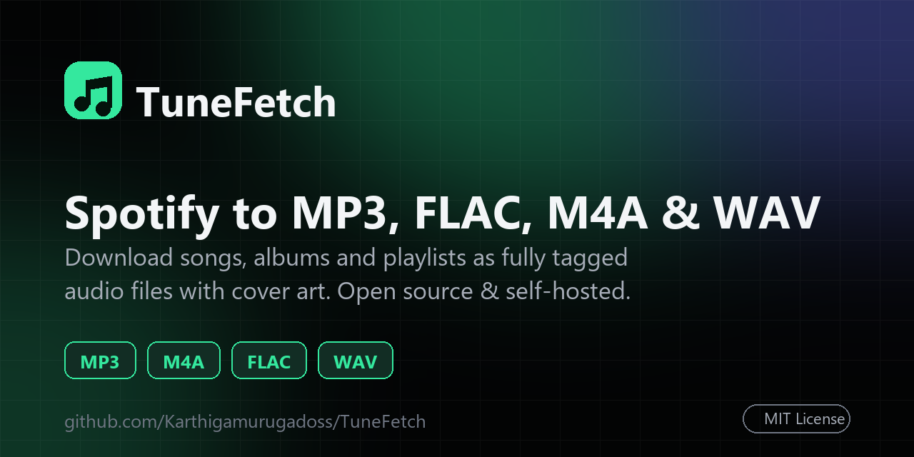
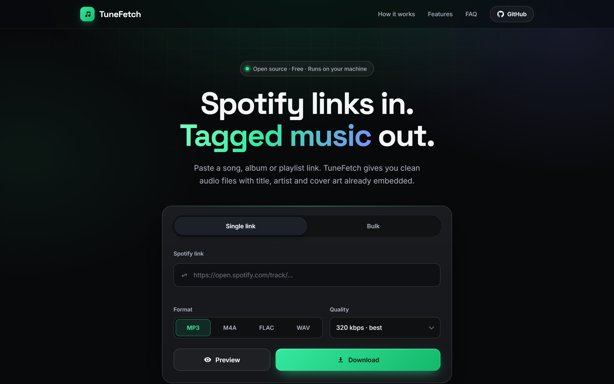
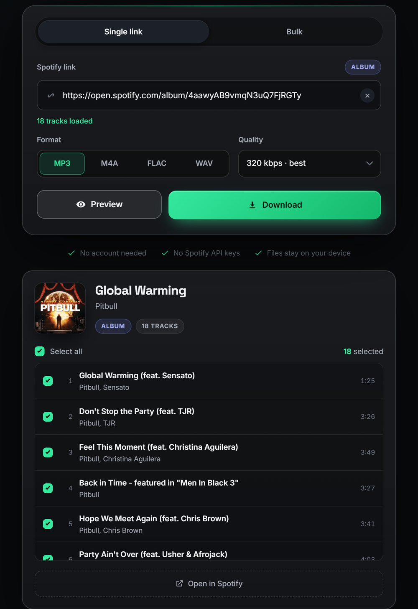
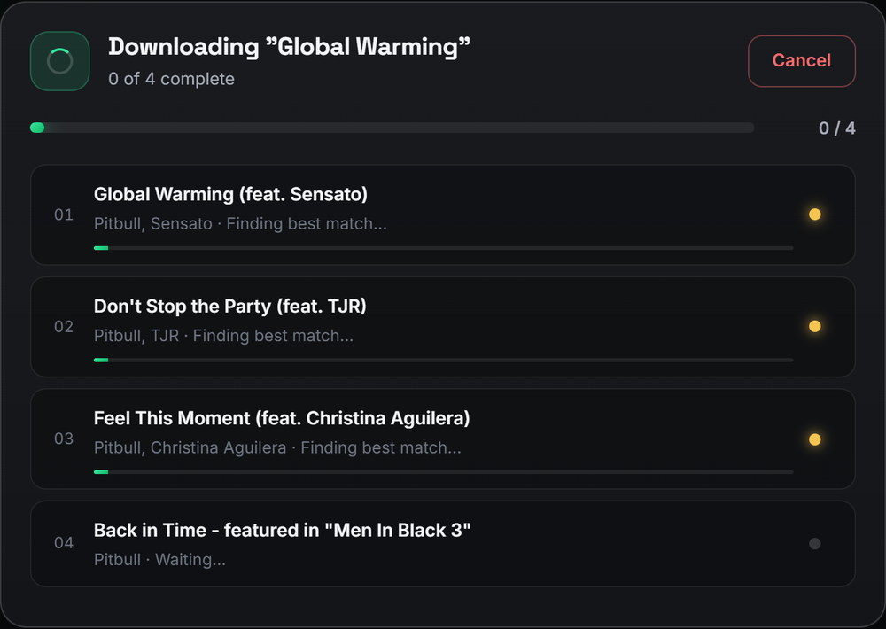
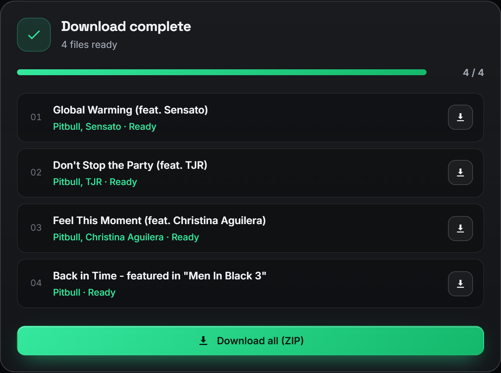
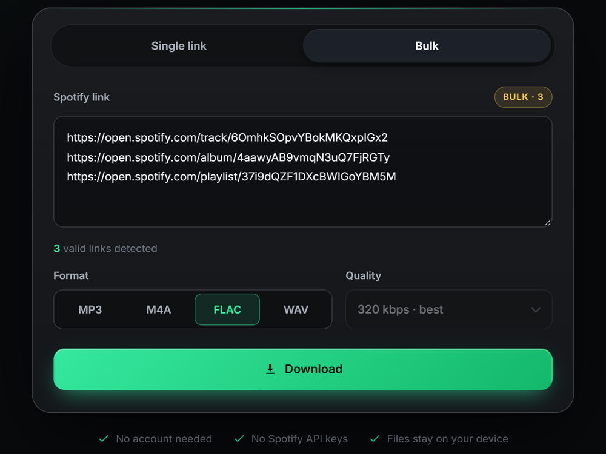
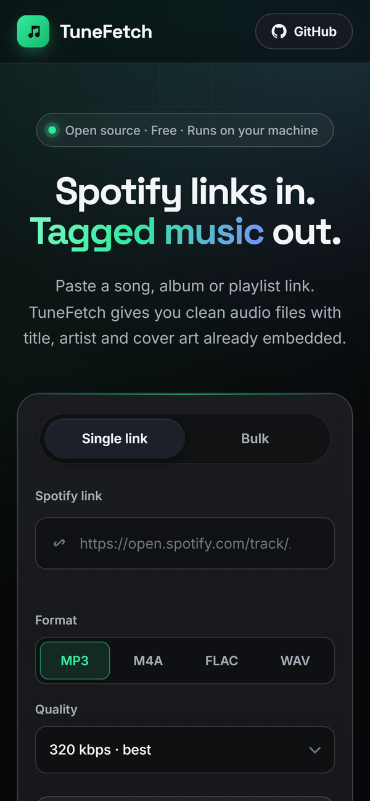

<h1 align="center">TuneFetch — Spotify Downloader</h1>

<p align="center">
  <strong>Download Spotify songs, albums and playlists to MP3, FLAC, M4A and WAV — with title, artist, track number and cover art already tagged.</strong><br>
  A free, open-source, self-hosted Spotify to MP3 converter built with Python, Flask and ffmpeg.
</p>

<p align="center">
  <a href="https://github.com/Karthigamurugadoss/TuneFetch/blob/main/docs/assets/social-preview.png"></a>
</p>

<p align="center">
  <a href="https://github.com/Karthigamurugadoss/TuneFetch/stargazers"></a>
  <a href="https://github.com/Karthigamurugadoss/TuneFetch/commits/main"></a>
  <a href="https://python.org"></a>
  <a href="https://flask.palletsprojects.com"></a>
  <a href="LICENSE"></a>
  <a href="https://karthigamurugadoss.github.io/TuneFetch/"></a>
</p>

<p align="center">
  <a href="https://karthigamurugadoss.github.io/TuneFetch/">Website</a> &nbsp;&middot;&nbsp;
  <a href="#features">Features</a> &nbsp;&middot;&nbsp;
  <a href="#installation">Installation</a> &nbsp;&middot;&nbsp;
  <a href="#how-to-download-a-spotify-playlist-to-mp3">How to use</a> &nbsp;&middot;&nbsp;
  <a href="#faq">FAQ</a> &nbsp;&middot;&nbsp;
  <a href="#contributing">Contributing</a>
</p>

---

**TuneFetch** is a free **Spotify downloader** that runs on your own computer. Paste a Spotify **track, album or playlist link**, pick **MP3, M4A, FLAC or WAV**, and TuneFetch saves clean audio files with the **title, artist, track number and album artwork embedded** — ready for your music player, phone or offline library.

It needs **no Spotify account, no Premium subscription and no API keys**. Everything runs locally in your browser at `http://127.0.0.1:5000`, and your files never leave your device.

> **Disclaimer:** TuneFetch is for personal and educational use. Only download music you own or have permission to use, and respect Spotify's and YouTube's terms of service and your local copyright law. TuneFetch is not affiliated with or endorsed by Spotify.

## Screenshots

<p align="center">
  
</p>

<table>
  <tr>
    <td width="50%" align="center"><br><sub><b>Preview an album or playlist</b> and untick tracks you don't want</sub></td>
    <td width="50%" align="center"><br><sub><b>Live progress</b> for every track, with cancel</sub><br><br><br><sub><b>Save tracks</b> one by one or as a single ZIP</sub></td>
  </tr>
  <tr>
    <td width="50%" align="center"><br><sub><b>Bulk mode</b> for many links at once</sub></td>
    <td width="50%" align="center"><br><sub><b>Responsive</b> on phones and tablets</sub></td>
  </tr>
</table>

## Table of contents

- [Screenshots](#screenshots)
- [Features](#features)
- [How it works](#how-it-works)
- [Installation](#installation)
- [How to download a Spotify playlist to MP3](#how-to-download-a-spotify-playlist-to-mp3)
- [Supported formats and quality](#supported-formats-and-quality)
- [FAQ](#faq)
- [Known limitations](#known-limitations)
- [Project structure](#project-structure)
- [Tech stack](#tech-stack)
- [Acknowledgements](#acknowledgements)
- [Contributing](#contributing)
- [License](#license)

## Features

- **Spotify song, album and playlist downloader** — paste any `open.spotify.com` track, album or playlist URL
- **Bulk mode** — queue many Spotify links at once, one per line
- **Spotify to MP3, M4A, FLAC and WAV** — choose the format that suits your player
- **Selectable bitrate** — 128, 192, 256 or 320 kbps for MP3 and M4A
- **Proper audio tagging** — title, artist, track number and embedded cover art in every format, plus the album name for album links
- **Pick your tracks** — preview a playlist or album and untick the songs you don't want
- **Smart song matching** — picks the closest match by title and duration
- **Fast parallel downloads** — three tracks at a time, with live per-track progress
- **Cancel and retry** — stop any time and retry only the tracks that failed; each failed track is also retried once automatically
- **Download as ZIP** — grab a whole album or playlist in a single archive
- **Modern, responsive web UI** — works on desktop and mobile browsers
- **Automatic cleanup** — download folders older than 24 hours are removed on startup and whenever a new download starts
- **Open source (MIT)** — read the code, fork it, change it

## How it works

```
Spotify link  ─►  track metadata (title, artist, album, cover art)
              ─►  best audio match, found by title + duration
              ─►  download  ─►  ffmpeg conversion  ─►  mutagen tagging
              ─►  tagged MP3 / M4A / FLAC / WAV files (or a ZIP)
```

TuneFetch reads the public metadata of your Spotify link, finds the best matching audio on YouTube Music using [ytmusicapi](https://github.com/sigma67/ytmusicapi), downloads it with [yt-dlp](https://github.com/yt-dlp/yt-dlp), converts it with [ffmpeg](https://ffmpeg.org/), and writes the tags and cover art with [mutagen](https://github.com/quodlibet/mutagen).

## Installation

### Requirements

- **Python 3.10 or newer**
- **ffmpeg** available on your `PATH`

Install ffmpeg:

```bash
# Windows
winget install Gyan.FFmpeg

# macOS (Homebrew)
brew install ffmpeg

# Debian / Ubuntu
sudo apt install ffmpeg
```

> TuneFetch is developed and tested on Windows. Because it is pure Python, it should run anywhere Python 3.10+ and ffmpeg do.

### Install and run

```bash
git clone https://github.com/Karthigamurugadoss/TuneFetch.git
cd TuneFetch
pip install -r requirements.txt
python app.py
```

Open <http://127.0.0.1:5000> in your browser. To use a different port, set the `PORT` environment variable, for example `PORT=8080 python app.py`.

## How to download a Spotify playlist to MP3

1. **Copy the link** — in Spotify, open a song, album or playlist, choose *Share* → *Copy link*.
2. **Paste it into TuneFetch** — use *Single link* for one URL or *Bulk* for many.
3. **Preview (optional)** — click **Preview** to see every track and untick the ones you don't want.
4. **Choose format and quality** — MP3, M4A, FLAC or WAV, and a bitrate for MP3 and M4A.
5. **Click Download** — watch each track finish, then save files one by one or click **Download all (ZIP)**.

## Supported formats and quality

| Format | Type | Bitrate choice | Tags and cover art |
|--------|------|:--------------:|:------------------:|
| **MP3** | Lossy, most compatible | 128 / 192 / 256 / 320 kbps | ✅ |
| **M4A** (AAC) | Lossy, great on Apple devices | 128 / 192 / 256 / 320 kbps | ✅ |
| **FLAC** | Lossless container | — | ✅ |
| **WAV** | Uncompressed container | — | ✅ |

The audio is sourced from YouTube Music, so quality depends on that source. FLAC and WAV are lossless *containers* and cannot add detail that isn't in the source audio.

## FAQ

### Can I download a Spotify playlist as MP3?
Yes. Paste the playlist link, choose MP3 and a bitrate, and download the tracks individually or as one ZIP file.

### Do I need Spotify Premium or an API key?
No. TuneFetch only reads the public information of a link. It does not log in to Spotify and needs no developer credentials.

### Is TuneFetch free?
Yes. It is free and open source under the [MIT license](LICENSE).

### Where does the audio come from?
TuneFetch takes the track details from Spotify and finds the best matching audio on YouTube Music by title and duration. It does not download audio from Spotify itself.

### Is there a limit on playlist size?
Spotify's public page lists about 100 tracks per playlist, so very large playlists may be shortened.

### Why does TuneFetch need ffmpeg?
ffmpeg converts the downloaded audio into MP3, M4A, FLAC or WAV. Install it once and make sure it is on your `PATH`.

### Where are my files saved?
In the `downloads` folder next to `app.py`, grouped by job. Old folders are deleted after 24 hours.

### Is it legal to use?
Laws differ by country. TuneFetch is meant for personal use with music you have the right to use. You are responsible for following copyright law and the terms of the services involved.

### Does it work on macOS and Linux?
It is developed and tested on Windows. It is pure Python and uses ffmpeg, so it should work on macOS and Linux too. Bug reports for other systems are welcome.

## Known limitations

- **Playlist length:** Spotify's public page lists about 100 tracks per playlist, so larger playlists may be shortened.
- **Release year:** Spotify's public page does not include a release year for albums and playlists, so only single-track links get a year tag.
- **Playlist cover art:** playlist tracks use the matched track's artwork, because Spotify does not expose per-track covers publicly.
- **Metadata source:** TuneFetch reads Spotify's public embed page, which is unofficial and could change without notice.
- **Local use only:** there is no authentication and it runs on Flask's development server, so don't expose it to the public internet.

## Project structure

```
TuneFetch/
├── app.py              # Flask backend: metadata, matching, download, tagging
├── requirements.txt    # Python dependencies
├── templates/
│   └── index.html      # Web UI
├── static/
│   ├── css/style.css   # Styles
│   └── js/app.js       # Front-end logic
├── docs/               # GitHub Pages website, screenshots and assets
└── .github/            # Issue and pull request templates
```

## Tech stack

[Python](https://python.org) · [Flask](https://flask.palletsprojects.com) · [yt-dlp](https://github.com/yt-dlp/yt-dlp) · [ytmusicapi](https://github.com/sigma67/ytmusicapi) · [mutagen](https://github.com/quodlibet/mutagen) · [ffmpeg](https://ffmpeg.org/)

## Acknowledgements

TuneFetch stands on the shoulders of excellent open-source projects: [yt-dlp](https://github.com/yt-dlp/yt-dlp), [ytmusicapi](https://github.com/sigma67/ytmusicapi), [mutagen](https://github.com/quodlibet/mutagen), [Flask](https://flask.palletsprojects.com) and [ffmpeg](https://ffmpeg.org/). Thank you to their maintainers.

## Contributing

Contributions are welcome. Read [CONTRIBUTING.md](CONTRIBUTING.md), then fork the repo, create a branch and open a pull request. Found a bug or have an idea? [Open an issue](https://github.com/Karthigamurugadoss/TuneFetch/issues/new/choose).

If TuneFetch is useful to you, please consider giving it a ⭐ — it helps other people find the project.

## License

Released under the [MIT License](LICENSE).
